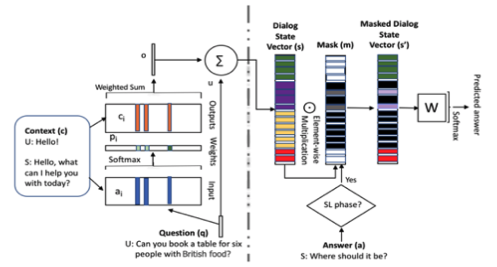
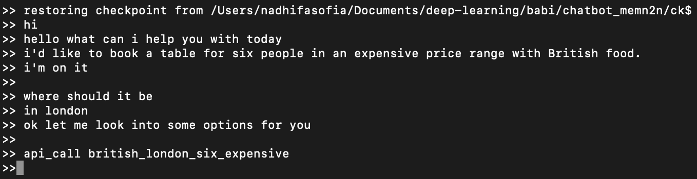

# chatbot_memn2n
Deep Learning Assignment with Mrs. Afiahayati, S.Kom., M.Cs., Ph.D
####
Nadhifa Sofia | 20/468173/SPA/00739


## Implementation of Deep Learning Method for Task-Oriented Dialog Model

This is the submission in order to get A on deep learning subject


## Setup

```bash
# python2 is not supported
sudo -H pip3 install -r requirements.txt
# if this doesn't work, raise an issue
```

## Learning End-to-End Goal-Oriented Dialog


```bash
# run main.py without arguments, for usage information
#  usage: main.py [-h] (-i | -t) [--task_id TASK_ID] [--batch_size BATCH_SIZE]
#               [--epochs EPOCHS] [--eval_interval EVAL_INTERVAL]
#               [--log_file LOG_FILE]
#  main.py: error: one of the arguments -i/--infer -t/--train is required
python3 main.py --train --task_id=3 --log_file=log.task3.txt
```





### Results

Task  |  Training Accuracy  |  Validation Accuracy  |
------|---------------------|-----------------------|
1     |  100	              |  99.7		            |
2     |  100                |  100		            |
3     |  100               |  74.71		            |
4     |  100               |  56.67		            |
5     |  100               |  98.42		            |
6     |  76.61               |  47.08		            |


